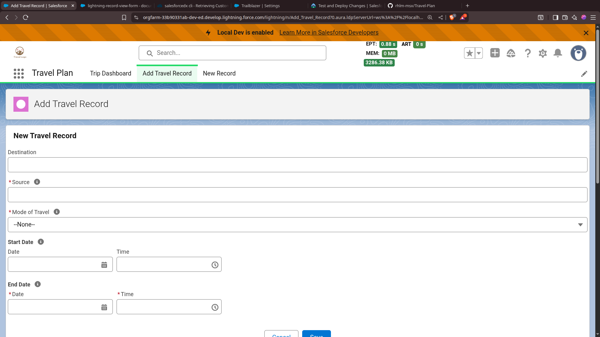
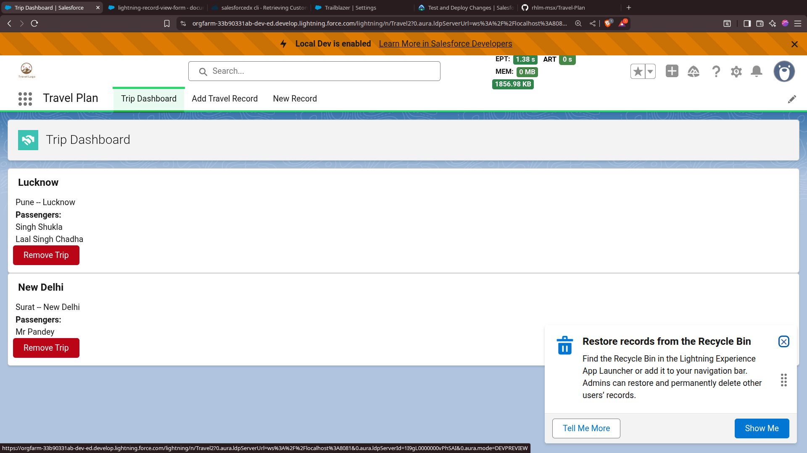

# Travel Plan 2

> A PoC for Salesforce SFDC Project Bootcamp.

## Changes
- I Recently learned that best practice to develop an salesforce application is to use a scratch org, as it allows source tracking which is important to sync the changes made with setup UI and locally, which is a challenge i stumble across while doing the same with Dev Org and unable to reliably sync the changes to and from org.

## CLI LOG

```bash

$ sf org create scratch -f config/project-scratch-def.json -d -a travel_scratch -v mainApp
# Pull Changes
$ sf project retrieve start
# Push Changes
$ sf project deploy start

```

## Issues

While deploying changes to new scratch org after following the source tracking for proper source code management of this app.
I Stumbled Across following issue.

```markdown
CustomIndex │ Passenger__c.Source__c │ An unexpected error occurred. │ │ │ │ │ Please include this ErrorId if you │ │ │ │ │ contact support: 1692867926-70468 │ │ │ │ │ (-402318292)
```

And solution that i found is to add custom index file of Passenger__c.Source__c in .forceignore.


---
# Travel Plan


## Quick Start

```bash
# Create a Scratch Org with specified config file (-f) and make it default (-d) and alias (-a) travel_scratch to refer in subsequent commands.
$ sf org create scratch -f config/project-scratch-def.json -d -a travel_scratch
# Deploy the source to scratch org
$ sf project deploy start
# Open the scratch org.
$ sf org open
```

## Reproducibility of Orgs

```bash
# This will generate a file called package.xml which contains metadata declaration in org.
$ sf project generate manifest --from-org <source-org>

# this will retrive all resources from org as described in the package.xml.
$ sf project retrieve start --manifest package.xml
```


## Concepts of Salesforce Covered Within this PoC

1. Trigger for Validation.
2. LWC Components for creating UI.
3. Data Fetch From Salesforce Database to UI (via LWC callback).


## Description

This salesforce app allows you to create travel records, and manage them 
- [x] Add New Travel Records
- [x] Dashboard for all travel records.
- [ ] Filters for dashboard.k
- [ ] Notification Service for upcomming journeys (scheduled execution).


## Details

A Travel Records represents Traveling of `Passengers` from one location to another via certain mode of transport.

- To Create a one (travel record) to many (passengers) relationship `Junction Object` is used.

> A Junction Object can be assumed as a table representing relationships between two other objects to create many to many relationship.

## Data Model

### Objects (Tables)

1. `Travel__c`
2. `Passenger__c`
3. `TravelingPassenger__c`


### Fields

#### Travel__c

1. Source (Text).
2. Destination (Text).
3. Start Date (Date).
4. End Date (Date).
5. Mode Of Travel(Enum).
    - Bus
    - Train
    - Flight
    - Other


## Todo

- [ ] Generate Sample Data.
- [ ] Import That data into Org.
- [ ] Create a Better `Add Travel Form`.
    - [ ] Ability to select already added passengers.
    - [ ] Add New Passengers.
    - [ ] DropDown of Already added Locations.
    - [ ] Map View of Source and Destination.

- [ ] Add a Record view
    - [ ] Filters with source, desitination.
    - [ ] Calendar View.
    
- [ ] Per Record View
    - [ ] Try external service integration with weather forcasting using destination weather.

- [ ] A `admin view`
    - [ ] A user with admin priviledges can see all travel records.
    - [ ] A Spider web view (dont know have to brain storm on this).


## Issues and Gaps
- [ ] Permission Sets.
- [ ] Unable to reproduce the same state of org as that of dev org (where i developed and configured it for the app).
    - [ ] Probable cause: the source code is not the correct representation of state of dev org
        - [ ] how to fetch complete state (metadata and relevant resources from the original org).

## Screenshots



