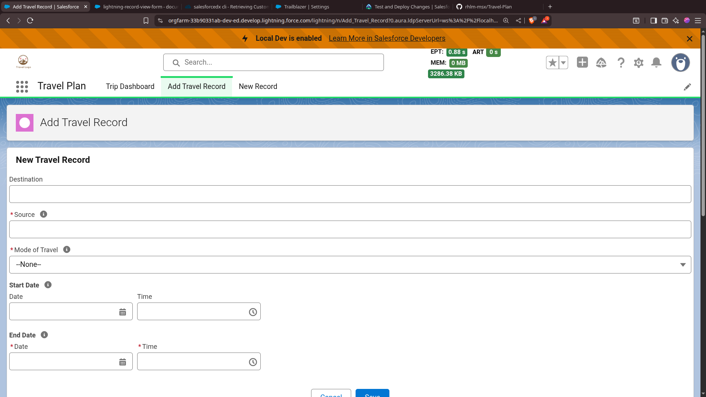
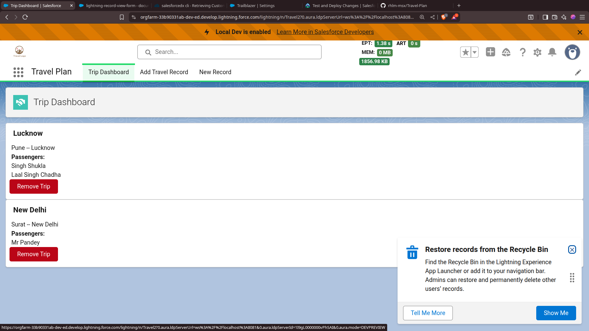

# Travel Plan

> A PoC for Salesforce SFDC Project Bootcamp.

## Concepts of Salesforce Covered Within this PoC

1. Trigger for Validation.
2. LWC Components for creating UI.
3. Data Fetch From Salesforce Database to UI (via LWC callback).

## Description

This salesforce app allows you to create travel records, and manage them 
- [x] Add New Travel Records
- [x] Dashboard for all travel records.
- [ ] Filters for dashboard.
- [ ] Notification Service for upcomming journeys (scheduled execution).

## Details

A Travel Records represents Traveling of `Passengers` from one location to another via certain mode of transport.

- To Create a one (travel record) to many (passengers) relationship `Junction Object` is used.

> A Junction Object can be assumed as a table representing relationships between two other objects to create many to many relationship.

## Screenshots

